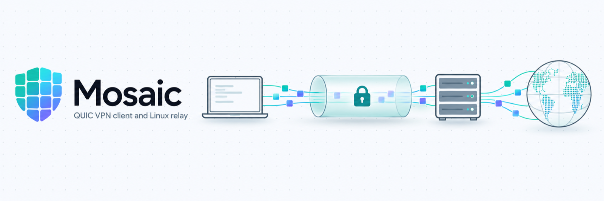
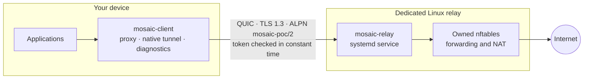

<p align="center">
  <picture>
    <source media="(prefers-color-scheme: dark)" srcset="docs/assets/banner-dark.png">
    
  </picture>
</p>

<p align="center">
  
  
  
  
  <a href="Cargo.toml"></a>
</p>

**Mosaic** is a VPN prototype that carries ordinary application traffic over authenticated QUIC to a dedicated Linux relay. It is written in Rust, with native clients for macOS, Windows, Linux, iOS and Android, a local SOCKS5 proxy, and a relay that installs and removes itself as a hardened systemd service.

The target product is a macOS and Windows VPN client plus a Linux relay with compiled setup and cleanup. Read [the prototype plan](Mosaic_Prototype_Plan_v2.docx) together with [the corrections](fixes.md); the corrections take precedence.

> [!IMPORTANT]
> This is development groundwork, not a desktop VPN deliverable. No macOS or Windows version or CPU architecture is supported yet as a delivered full-device VPN, and native compilation alone does not establish platform support. See [Status](#status).

[Quick start](#quick-start) · [How it works](#how-it-works) · [Native clients](native/README.md) · [Relay setup](docs/relay/README.md) · [Local proxy](docs/proxy/README.md) · [Test records](docs/testing/README.md) · [Development](docs/development/README.md)

## Status

| Area | State |
| --- | --- |
| Authenticated QUIC diagnostics, bounded packet framing | Implemented |
| Linux isolated TUN, namespace routing and private DNS | Implemented; verified live on both supplied servers |
| Native HTTPS fetch and relay forwarding | Implemented |
| Relay installer, systemd service and owned forwarding | Implemented; installation verified live |
| Local SOCKS5 proxy | Implemented; verified live from a separate node |
| macOS, iOS, Windows, Linux and Android native clients | Compile; installed-device acceptance BLOCKED |
| Native Mac QUIC, uninterrupted automation, live egress, DNS and outage acceptance | Incomplete |

<details>
<summary>What the native builds cover today</summary>

- **macOS:** applications and extensions compile for Apple silicon and Intel. The Apple Silicon `mosaic-client` binary is a diagnostic development build.
- **iOS:** the application and extension compile for arm64.
- **Android:** builds an APK for arm64 and x64.
- **Linux and Windows:** cross-builds pass. Windows installation and networking have not been verified.
- **Missing here:** Apple signing assets, a Windows installer environment and physical platform acceptance.

Linux namespace evidence covers only isolated test applications. [`tests/manifest.json`](tests/manifest.json) keeps installed-device acceptance BLOCKED separately from implementation and compilation, and no target is certified from these builds alone.

</details>

Local test results do not certify desktop VPN delivery, live deployment or VPN preservation. Every result, including failed runs, is in [the live test records](docs/testing/README.md).

## Quick start

Build the workspace (Rust 1.96.0 is pinned in `rust-toolchain.toml`):

```sh
cargo build --workspace --locked
```

### 1. Set up a relay

On a dedicated Linux server, generate credentials, copy `configs/relay.example.json` to `configs/relay.json` and edit it, then check the config and install the service:

```sh
./scripts/provision.sh --dedicated-relay relay.your-domain.tld configs/secrets
./mosaic-relay -c configs/relay.json --check-config
sudo ./mosaic-relay -c configs/relay.json --setup
```

Copy only `relay.crt` and `client.token` to the client over a trusted channel. The private key never leaves the relay. Full details: [relay setup](docs/relay/README.md).

### 2. Configure the client

Copy `configs/client.example.json` to `configs/client.json`, set the relay address and name, and place the certificate and token under `configs/secrets/`. Then validate it:

```sh
./mosaic-client check-config -c configs/client.json
./mosaic-client preflight -c configs/client.json
```

### 3. Connect

Run authenticated diagnostics against the relay:

```sh
./mosaic-client test -c configs/client.json --case session
```

Or start the local SOCKS5 proxy and point applications at `127.0.0.1:1080`:

```sh
./mosaic-client proxy -c configs/client.json --interface en0
```

The proxy needs no administrator rights and no Apple signing. For full-device connections, see [native clients](native/README.md).

## How it works



- **Authentication:** the client verifies the relay certificate, name and ALPN before sending its 32-byte token. Every new connection completes `SessionInit`, `SessionReady` and `ClientReady` before any traffic flows. See [the session protocol](docs/session/README.md).
- **Traffic:** IPv4 packets travel as QUIC datagrams with a 12-byte header and MTU 1100. Proxied TCP connections each get their own QUIC stream.
- **Recovery:** native and isolated tunnel clients retry after 1, 2, 4 and 8 seconds with jitter, and the proxy reconnects when the relay restarts. Every new session is authenticated again.
- **Relay:** the installed service runs `--tunnel --forwarding --proxy` and drops traffic to private, link-local, loopback and the relay's own networks.
- **IPv6:** the inner tunnel is IPv4-only. Native platform integration blocks IPv6 rather than leaking it.

| Crate | Role |
| --- | --- |
| [`mosaic-core`](crates/mosaic-core) | Shared protocol, QUIC transport, packet framing and integration tests |
| [`mosaic-client`](crates/mosaic-client) | Client command line: diagnostics, fetch, proxy, native connect and Linux isolation |
| [`mosaic-relay`](crates/mosaic-relay) | Relay service, installer and owned forwarding |
| [`mosaic-native`](crates/mosaic-native) | Shared engine for the native platform clients |

## Security

- **Credentials:** tokens appear only inside encrypted application data and never in reports. Token and key files must be owner-only.
- **TLS:** 0-RTT and TLS resumption are disabled. An expired relay certificate fails before the token is sent.
- **Relay exposure:** an unlimited relay lets anyone holding the token use its full uplink. Set `limits.max_mbps` when that matters.
- **Handshake visibility:** QUIC Initial protection does not hide the server name or ALPN from an observer. See [handshake visibility](docs/client/README.md#handshake-visibility).
- **Shared nodes:** never test on a node with an existing VPN without first recording [a health baseline](docs/baseline/README.md).

> [!CAUTION]
> Secrets, private configs, raw baselines, generated binaries and run evidence are ignored by Git. Never commit a relay private key or a private ready-to-use config.

## Documentation

| Goal | Start here |
| --- | --- |
| Install a VPN client on a device | [Native clients](native/README.md) |
| Run diagnostics and read reports | [Client command line](docs/client/README.md) |
| Set up, install or remove a relay | [Relay setup](docs/relay/README.md) |
| Proxy applications without a VPN | [Local proxy](docs/proxy/README.md) |
| Understand the wire protocol | [Session protocol](docs/session/README.md) |
| Run the isolated Linux tunnel | [Isolated TUN](docs/isolation/README.md) |
| Check namespace DNS and outages | [Namespace DNS and routing](docs/dns/README.md) |
| Test forwarding and native HTTPS | [Internet forwarding](docs/egress/README.md) |
| Protect a shared node's existing VPN | [Shared node baseline](docs/baseline/README.md) · [Xray health probes](tools/xray/README.md) |
| See what passed and what failed | [Live test records](docs/testing/README.md) |
| Build, test and package | [Development](docs/development/README.md) |

## Development

Run the local checks; the deployment check stays BLOCKED until live gates pass:

```sh
python3 scripts/check.py 5 --local-only
python3 scripts/check.py 5
```

Check levels, what the tests cover, packaging and the repository layout are in [the development guide](docs/development/README.md).

## License

Mosaic is licensed under the MIT license, as declared in [`Cargo.toml`](Cargo.toml).
