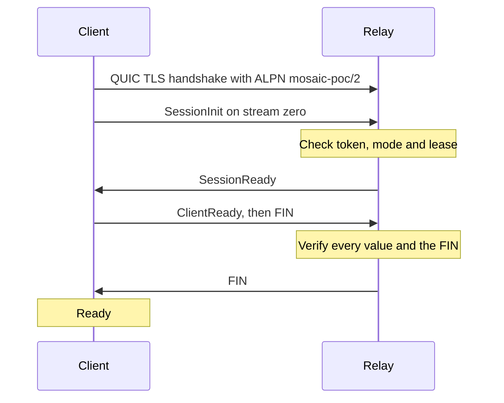

# Session protocol

[Mosaic](../../README.md) › Docs › Session protocol

This page describes the control exchange that runs between a Mosaic client and relay after the QUIC handshake. It also covers the diagnostic, tunnel and fetch session modes that follow it.

> [!IMPORTANT]
> The relay loads credentials at startup. Changing its token requires restarting that exact relay process. No reconnect or credential rotation protocol is implemented.

> [!NOTE]
> Sequence numbers count unique replies and measure loss. They provide no replay protection or custom cryptography.

**Contents:** [Transport](#transport) · [Control framing](#control-framing) · [Handshake](#handshake) · [Diagnostic mode](#diagnostic-mode) · [Tunnel mode](#tunnel-mode) · [Fetch mode](#fetch-mode) · [Credentials](#credentials) · [See also](#see-also)

## Transport

The session protocol runs after verified QUIC TLS with ALPN `mosaic-poc/2`.

- **No early data:** TLS resumption and 0-RTT are disabled.
- **Control stream:** the client opens bidirectional stream zero for control.
- **Deadline:** the control exchange has a five-second deadline.

## Control framing

Each control message is a u32 big-endian byte length followed by exactly that many bytes of typed JSON. Lengths are checked before payload allocation.

The session fails on any of the following:

- **Empty messages.**
- **Oversized messages:** lengths above the configured cap or 4096 bytes.
- **Bad fields:** duplicate or unknown fields.
- **Bad input:** invalid JSON or truncated input.

## Handshake

The handshake has three control messages. The client returns Ready only after both control directions have finished.

### SessionInit

The client sends `SessionInit` with these fields.

| Field | Value |
| --- | --- |
| `type` | Message type |
| `version` | 2 |
| `mode` | `diagnostic`, `tunnel` or `fetch` |
| `token` | 64 hexadecimal characters encoding exactly 32 bytes |
| `mtu` | 1100 |
| `send_limit` | The client's current Quinn maximum datagram size |

The relay compares decoded tokens with the established constant-time routine from `subtle`.

- **Tunnel mode:** requires the Linux relay's `--tunnel` service and an available single-owner lease. Diagnostic-only service still rejects it.
- **Lease lifetime:** the lease is acquired during authorization and released on rejection, connection termination or service shutdown.

### SessionReady

The relay replies with `SessionReady` and these fields.

| Field | Value |
| --- | --- |
| `type` | Message type |
| `version` | Protocol version |
| `mode` | Agreed mode |
| `mtu` | Agreed MTU |
| `send_limit` | Agreed limit: the minimum of both reported send limits |
| `session_id` | Session identifier, described below |

Each reported send limit must fit 1100 payload bytes plus the 12-byte packet header.

| Failure | Application code | Reason |
| --- | --- | --- |
| Unsupported or insufficient datagram capacity | 2 | Fixed size error |
| Other authorization failures | 1 | Fixed redacted reason |

### Session identifier

The session identifier is 32 bytes of TLS exporter output encoded as lowercase hex.

- **Exporter label:** `mosaic session identifier`.
- **Exporter context:** `2`.
- **Derivation:** each peer independently derives the identifier from its established connection.
- **Scope:** it changes on a fresh connection and is never a substitute for the token.

The client validates the identifier, version, requested mode, MTU and agreed limit.

### ClientReady

The client sends `ClientReady` repeating all agreed values, then finishes its control direction. The relay verifies every value and the FIN, then finishes its response direction. The client waits for that FIN before returning Ready.

Extra control bytes, an additional stream or datagrams observed before Ready reject the connection.

## Diagnostic mode

No tunnel setup or IP packet injection exists in diagnostic mode.

### Echo streams

Subsequent bidirectional streams carry one reliable echo payload each.

- **Size:** bounded to 65536 bytes and terminated by FIN.
- **Control cap:** the control size cap does not apply to these streams.
- **Concurrency:** the relay can process three simultaneously.

### Datagram layout

Diagnostic datagrams use this big-endian layout.

| Field | Bytes | Value |
| --- | --- | --- |
| Version | 1 | 2 |
| Kind | 1 | 1 for diagnostic echo |
| Payload length | 2 | 1 through 1100 |
| Sequence | 8 | Unsigned diagnostic sequence |
| Payload | Declared length | Exact diagnostic bytes |

The datagram kinds are assigned as follows.

| Kind | Use |
| --- | --- |
| 0 | Reserved |
| 1 | Diagnostic echo |
| 2 | IPv4 in tunnel sessions; rejected by diagnostic sessions |

### Validation

The receiver checks the whole size, version, diagnostic kind and declared length before echoing. QUIC datagrams can be lost, duplicated or reordered.

- **Sequences:** count unique replies and measure loss. They provide no replay protection or custom cryptography.
- **Responses:** every response is checked against its sequence-specific expected payload.
- **Duplicates:** duplicate responses cannot satisfy the unique-reply threshold.

## Tunnel mode

Tunnel datagrams have the same header with kind 2 and one complete IPv4 packet. New reliable streams are rejected in tunnel mode.

### Packet validation

- **Header checks:** both directions validate size, version, IHL, total length, header checksum and fragmentation fields.
- **Preserved forms:** valid fragments and IPv4 options are preserved.
- **Address checks:** the relay validates the configured client source before injection, and the client validates its destination before injection. Outbound packets also receive the corresponding address check.
- **Invalid packets:** counted and discarded.

### Packet pumps

| Property | Behavior |
| --- | --- |
| Queue | Each direction has a bounded queue of at most 256 packets |
| Concurrency | Separate read and write futures allow bidirectional traffic even when the opposite direction is waiting |
| Pacing | A shared schedule within each pump limits aggregate packet work with transport-overhead headroom |
| Quinn buffers | Datagram buffers remain 256 KiB |
| Send checks | Sender capacity is rechecked before every send; oversize errors stop the pump |
| Teardown | Dropping the pump cancels all four futures and discards their queues |

No packet state survives a connection failure.

## Fetch mode

Fetch mode requires the relay's explicit `--fetch` option and uses the same authorization and readiness exchange. On a new bidirectional stream the client sends a bounded `OpenTcp` control message. The client starts destination TLS only after the relay responds.

| Message | Direction | Example | Meaning |
| --- | --- | --- | --- |
| `OpenTcp` | Client to relay | `{"type":"OpenTcp","host":"example.com","port":443}` | Requests a TCP connection |
| `TcpReady` | Relay to client | `{"type":"TcpReady","max_bytes":33554432,"timeout_s":300}` | Connected; reports the remaining byte budget and configured session deadline |
| `TcpRejected` | Relay to client | `{"type":"TcpRejected"}` | Denied or unavailable destination, followed by a finished response |

The relay validates the configured allowlist and resolved IPv4 addresses, then connects to a checked address before sending `TcpReady`. Rejected requests count against the request limit.

### Stream data

- **Payload:** after `TcpReady`, stream bytes are opaque TCP payload.
- **Half-close:** FIN half-closes the corresponding TCP direction.
- **Budget:** both directions share the connection byte budget, including TLS/HTTP overhead.
- **Concurrency:** the relay serves one stream at a time.
- **Datagrams:** fetch sessions reject datagrams.

Malformed headers, transfer errors, exhausted request/byte budgets or the session deadline close the fetch connection.

### Compatibility

Diagnostic wire bytes and tunnel datagram framing are unchanged. Older relays reject the new fetch session mode.

## Credentials

The relay loads credentials at startup. Changing its token requires restarting that exact relay process.

A valid session remains usable for its bounded workload. No reconnect or credential rotation protocol is implemented.

## See also

- [Fetch and forwarding guide](../egress/README.md)
- [Relay setup](../relay/README.md)
- [Native client commands](../client/README.md)
- [Isolated TUN checks](../isolation/README.md)
- [Mosaic README](../../README.md)
